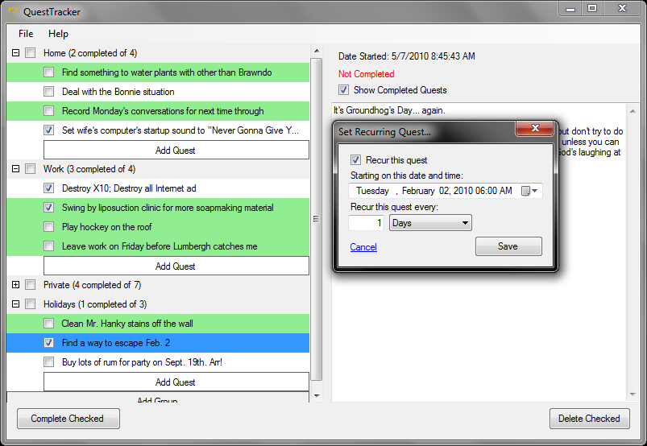

Please see the [Downloads](http://questtracker.codeplex.com/releases/) page for the latest version's release notes and for the portable installer.

QuestTracker is a todo list (task list) presented in the format of a quest tracking list such as the one in World of Warcraft.

QuestTracker has at its heart the following goals: 
* **Simplicity:** Managing your tasks should not get in the way of doing your tasks. QuestTracker tries to stay out of the way of organizing your tasks by minimizing your mouse clicks and keystrokes. Features are designed to reduce the time spent in the program. 
* **Usability:** QuestTracker tries to be intuitive to use. All major functions can be performed with one or two clicks and a few seconds of typing. Everything is automatically saved for you, and extra backups can be made quickly and easily. Most features should be natural for most users accustomed to using other Windows applications.
* **Efficiency:** Saving time is of utmost importance. That's why you're using a todo list in the first place. You want all of your tasks in one place so you don't have to go digging through emails or wandering around your house trying to figure out what needs to be done next. QuestTracker is designed to make creating and managing your todo list as efficient as possible.

Screenshot:
